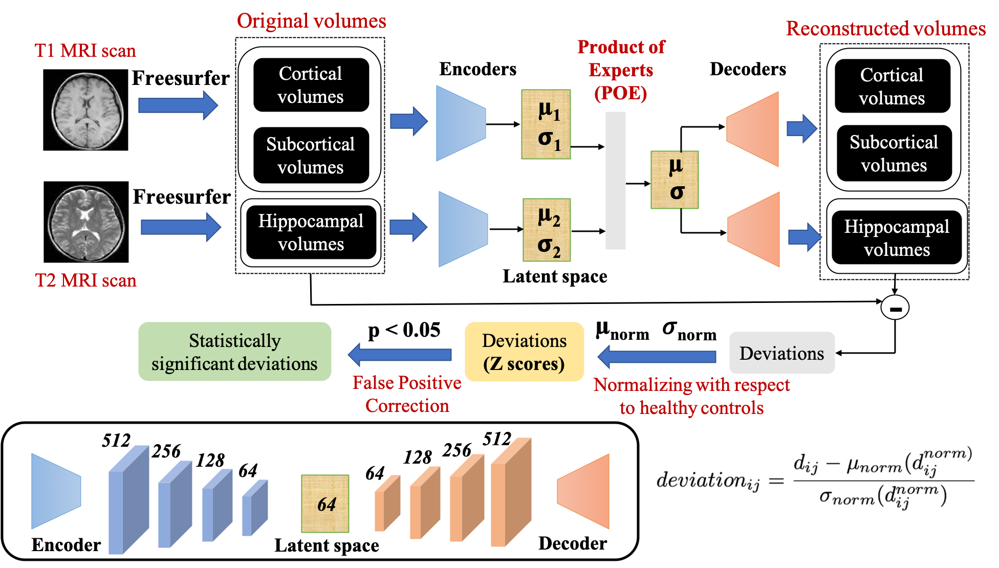
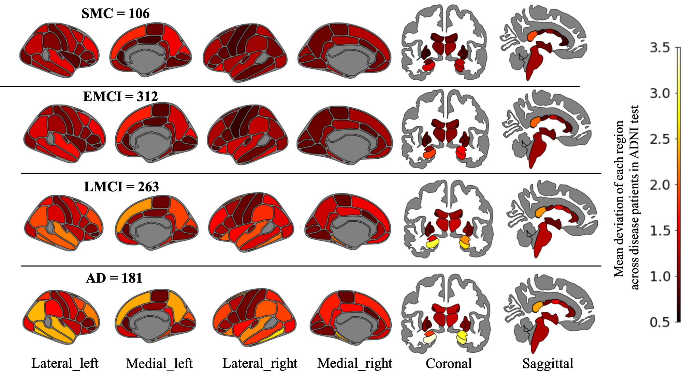
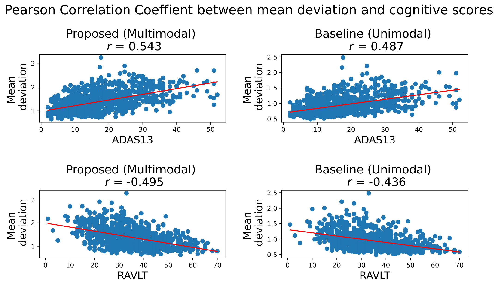
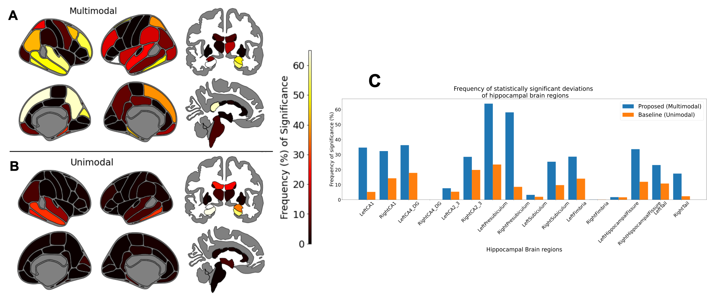

# Overview
This repository contains official implementation for our paper titled "Normative modeling using multimodal variational autoencoders to identify abnormal brain volume deviations in Alzheimer's disease", published in the proceedings of SPIE Medical Imaging 2023. [[Paper](https://dl.acm.org/doi/pdf/10.1145/3535508.3545547)] [[Slides](https://docs.google.com/presentation/d/13uWGCq-Co8ZOtEEuAgeXzQxv_0F9JK_B/edit#slide=id.p1)]

 

Figure 1: Our proposed multimodal normative modeling framework (mmVAE).

## Abstract

Normative modelling is a method for understanding the underlying heterogeneity within brain disorders like Alzheimer Disease (AD), by quantifying how each patient deviates from the expected normative pattern that has been learned from a healthy control distribution. Existing deep learning based normative models have been applied on only single modality Magnetic Resonance Imaging (MRI) neuroimaging data. However, these do not take into account the complementary information offered by multimodal MRI, which is essential for understanding a multifactorial disease like AD. To address this limitation, we propose a multi-modal variational autoencoder (mmVAE) based normative modelling framework that can capture the joint distribution between different modalities to identify abnormal brain volume deviations due to AD. Our multi-modal framework takes as input Freesurfer processed brain region volumes from T1-weighted (cortical and subcortical) and T2-weighed (hippocampal) scans of cognitively normal participants to learn the morphological characteristics of the healthy brain. The estimated normative model is then applied on AD patients to quantify the deviation in brain volumes and identify abnormal brain pattern deviations due to the progressive stages of AD. We compared our proposed mmVAE with a baseline unimodal VAE having a single encoder and decoder and the two modalities concatenated as unimodal input. Our experimental results show that deviation maps generated by mmVAE are more sensitive to disease staging within AD, have a better correlation with patient cognition and result in higher number of brain regions with statistically significant deviations compared to the unimodal baseline model.

# Implementation details

## Environment & Packages

We recommend an environment with python >= 3.7 and pytorch >= 1.10.2, and then install the following dependencies:
```
pip install -r requirements.txt
```
Cortical and subcortical brain atlases were visualized using the ggseg package. The original R implementation can be found [here](https://github.com/ggseg/ggseg). A more recent Python implementation can also be found [here](https://github.com/ggseg/python-ggseg).

## Datasets & Feature extraction

### Datasets

We used the UKBioBank and ADNI datasets in our study. UK Biobank data are available through a procedure described at [http://www.ukbiobank.ac.uk/using-the-resource/](http://www.ukbiobank.ac.uk/using-the-resource/). ADNI data are available through an access procedure described at [http://adni.loni.usc.edu/data-samples/ access-data/](http://adni.loni.usc.edu/data-samples/ access-data/).

### Feature extraction


## Model training

- **dataloaders.py** - Dataloader functions for train, test and validation splits
  
- **mvae_POE.py** - Implements the architecture for mmVAE including the modality-specific encoders and decoders, Product-of-Experts (PoE), and multimodal ELBO loss function
  
- **training_multimodal.py** - mmVAE training.
  - Step 1: Train on UKB healthy controls
  - Step 2: Save trained model
  - Step 3: Load saved model and fine-tune on ADNI healthy controls
  - Step 4: Calculate deviations on disease subjects in ADNI
  
- **training_unimodal.py** - Training unimodal baseline VAE where all modalities are concatenated together into a single input. Steps same as mmVAE training.

## Performance evaluation

- Sensitivity of deviation maps towards disease staging
  - Patient-level deviation maps - **deviation_staging.py**
  - Regional deviation maps - **significant_regional_deviations.py**
    
- Correlation of deviation maps with patient cognition - **correlation_with_cognition.py**
  
- Identifying brain regions with abnormal deviations - **significant_regional_deviations.py**

 

Figure 2: Mean deviation maps of each cortical and subcortical brain region (derived from T1-weighted MRI) generated by our proposed multimodal mmVAE. **Region-wise deviations increase with the severity of the disease** from SMC (Significant Memory Concern) --> Early Mild Cognitive Impairment (EMCI) --> Late Mild Cognitive Impairment (EMCI) --> Alzehiemer Disease (AD).

 

Figure 3: Pearson Correlation between patient-level deviations and patient cognition represented by ADAS13 (top row) and RAVLT (bottom row). r indicates the correlation coefficient value. Each point in the plot represents a patient and the dark red line denotes the linear regression fit of the points. **mmVAE exhibited higher correlation with patient cognition, compared to the unimodal baseline**.



Figure 4. Frequency of significance: Number of times (%) each cortical and subcortical region volume (**A,B**), derived from T1- weighted MRI data and hippocampal volumes (**C**), derived from T2-weighted MRI (exhibited statistically significant deviations (p < 0.05) across all disease patients in the ADNI test set for both proposed mmVAE and baseline (unimodal VAE). **The regions with higher frequency of significance across both the models (proposed and baseline) correspond to the regions with abnormal brain deviations. In other words, we can get an idea which of the brain regions have significantly higher deviation in brain volumes due to the progressive stages of AD compared to the other regions.**


## Acknowledgement

This work was supported by National Institutes of Health (NIH) grant number NIH R01-AG067103.
  
## Citation
If you find our work is useful in your research, please consider raising a star  :star:  and citing:

```
@inproceedings{kumar2023normative,
  title={Normative modeling using multimodal variational autoencoders to identify abnormal brain volume deviations in Alzheimer's disease},
  author={Kumar, Sayantan and Payne, Philip RO and Sotiras, Aristeidis},
  booktitle={Medical Imaging 2023: Computer-Aided Diagnosis},
  volume={12465},
  pages={1246503},
  year={2023},
  organization={SPIE}
}
