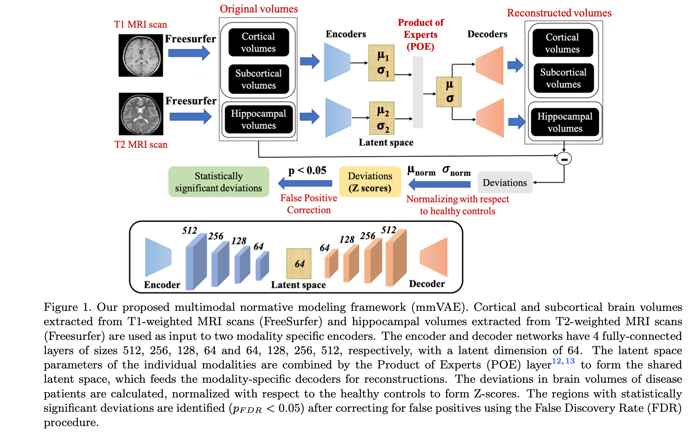
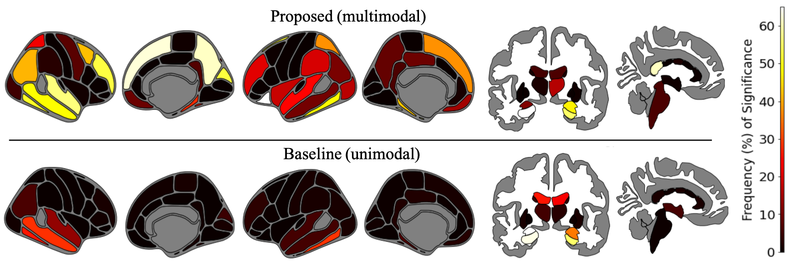

# Overview
This repository contains official implementation for our paper titled "Normative modeling using multimodal variational autoencoders to identify abnormal brain volume deviations in Alzheimer's disease", published in the proceedings of SPIE Medical Imaging 2023. [[Paper](https://dl.acm.org/doi/pdf/10.1145/3535508.3545547)] [[Slides](https://docs.google.com/presentation/d/13uWGCq-Co8ZOtEEuAgeXzQxv_0F9JK_B/edit#slide=id.p1)]




## Abstract

Normative modelling is a method for understanding the underlying heterogeneity within brain disorders like Alzheimer Disease (AD), by quantifying how each patient deviates from the expected normative pattern that has been learned from a healthy control distribution. Existing deep learning based normative models have been applied on only single modality Magnetic Resonance Imaging (MRI) neuroimaging data. However, these do not take into account the complementary information offered by multimodal MRI, which is essential for understanding a multifactorial disease like AD. To address this limitation, we propose a multi-modal variational autoencoder (mmVAE) based normative modelling framework that can capture the joint distribution between different modalities to identify abnormal brain volume deviations due to AD. Our multi-modal framework takes as input Freesurfer processed brain region volumes from T1-weighted (cortical and subcortical) and T2-weighed (hippocampal) scans of cognitively normal participants to learn the morphological characteristics of the healthy brain. The estimated normative model is then applied on AD patients to quantify the deviation in brain volumes and identify abnormal brain pattern deviations due to the progressive stages of AD. We compared our proposed mmVAE with a baseline unimodal VAE having a single encoder and decoder and the two modalities concatenated as unimodal input. Our experimental results show that deviation maps generated by mmVAE are more sensitive to disease staging within AD, have a better correlation with patient cognition and result in higher number of brain regions with statistically significant deviations compared to the unimodal baseline model.

# Implementation details

## Data extraction & Feature preprocessing

## Model training

## Performance evaluation

- Sensitivity of deviation maps towards disease staging
  - Patient-level deviation maps - **deviation_staging.py**
  - Regional deviation maps - **significant_regional_deviations.py**
- Correlation of deviation maps with patient cognition - **correlation_with_cognition.py**
- Identifying brain regions with abnormal deviations - **significant_regional_deviations.py**





## Citation
If you find our work is useful in your research, please consider raising a star  :star:  and citing:

```
@inproceedings{kumar2023normative,
  title={Normative modeling using multimodal variational autoencoders to identify abnormal brain volume deviations in Alzheimer's disease},
  author={Kumar, Sayantan and Payne, Philip RO and Sotiras, Aristeidis},
  booktitle={Medical Imaging 2023: Computer-Aided Diagnosis},
  volume={12465},
  pages={1246503},
  year={2023},
  organization={SPIE}
}
